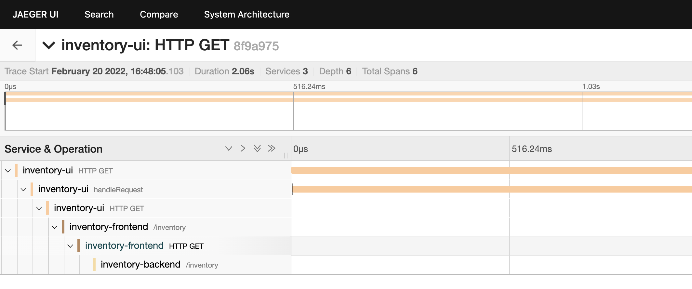

# Gin Example with OTEL Instrumentation

## Running

```shell
# In one terminal session
$ cd inventory-frontend && go run main.go

# In a second terminal session
$ cd inventory-backend && go run main.go

# In a third terminal session
$ cd inventory-ui && npm run jaeger:server
```

## Verification

1. Run [Jaeger All In One](https://www.jaegertracing.io/docs/latest/getting-started/#all-in-one).
2. Open (or refresh) the following URL in a browser: http://localhost:8080/ 
   1. The following should be visible in the browser, which is the response from inventory-backend:
      ```json
      {"inventory":{"products":[{"name":"potato","price":0.99,"id":"1"},{"name":"apple","price":0.5,"id":"2"},{"name":"mango","price":1.5,"id":"3"}]}}
      ```
3. Open http://localhost:16686/ in a browser.
4. Check the services `inventory-ui`, `inventory-frontend` and `inventory-backend` are present.
5. Choose one of these services and click `Find Traces`.
6. You should see all three services as spans in a single trace:



